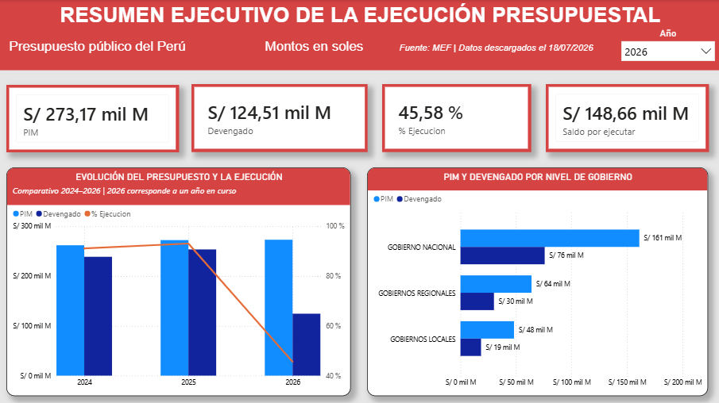
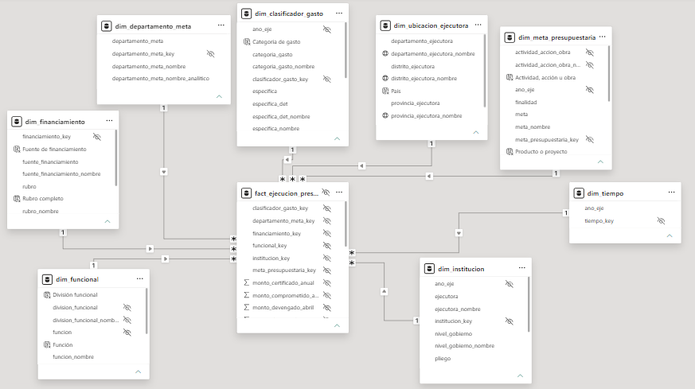

# Peru Public Budget Monitor

Proyecto analítico end-to-end para el seguimiento de la ejecución presupuestaria pública del Perú a partir de datos oficiales del Ministerio de Economía y Finanzas (MEF).

La solución integra ingesta reproducible, controles de calidad, transformación, almacenamiento en PostgreSQL, modelado dimensional, validaciones SQL y visualización interactiva en Power BI.

## Estado del proyecto

> **Versión 1.0 finalizada.**

La solución implementada comprende:

- descarga reproducible de datos oficiales de 2024, 2025 y 2026;
- registro de manifiestos, metadatos y hashes SHA-256;
- verificación de integridad de archivos;
- revisión del diccionario oficial de 73 variables;
- transformación y consolidación mediante Python;
- almacenamiento de staging en PostgreSQL;
- modelo dimensional con una tabla de hechos y ocho dimensiones;
- reconciliación exacta de importes entre archivos procesados y PostgreSQL;
- pruebas automatizadas;
- dashboard de siete páginas en Power BI;
- documentación técnica y funcional.

El archivo correspondiente a 2026 utilizado en esta versión fue descargado y verificado el **18/07/2026, hora de Perú**.

---

## Vista previa



La descripción completa de las páginas, indicadores y controles del informe se encuentra en:

[Documentación del dashboard de Power BI](docs/power_bi_dashboard.md)

---

## Objetivo

Transformar datos oficiales de ejecución presupuestaria en información confiable y útil para:

- analizar el presupuesto inicial y el presupuesto vigente;
- evaluar certificación, compromiso, devengado y girado;
- comparar niveles de gobierno;
- analizar entidades y unidades ejecutoras;
- identificar concentraciones presupuestarias;
- estudiar funciones y estructura programática;
- comparar departamentos;
- analizar fuentes de financiamiento y tipos de gasto;
- explorar geográficamente la ubicación de las unidades ejecutoras;
- mantener trazabilidad entre fuentes, transformaciones y resultados.

---

## Arquitectura

```text
Datos abiertos del MEF
        ↓
Configuración de fuentes
        ↓
Extracción reproducible con Python
        ↓
Manifiestos y hashes SHA-256
        ↓
Verificación de integridad
        ↓
Perfilado y controles de calidad
        ↓
Transformación y consolidación
        ↓
PostgreSQL: esquema staging
        ↓
PostgreSQL: modelo dimensional analytics
        ↓
Validaciones y reconciliación SQL
        ↓
Power BI
```

---

## Fuentes de datos

La fuente principal es el conjunto oficial:

**Presupuesto y Ejecución de Gasto – Devengado Mensual**

Publicado por el Ministerio de Economía y Finanzas del Perú.

| Año | Recurso |
|---|---|
| 2024 | `2024-Gasto-Devengado.csv` |
| 2025 | `2025-Gasto-Devengado-Mensual.csv` |
| 2026 | `2026-Gasto-Devengado-Mensual.csv` |
| Diccionario | `Gasto_Devengado_Diccionario.csv` |

Los archivos originales no se versionan en GitHub debido a su tamaño. Pueden reproducirse mediante el proceso de ingesta documentado en el repositorio.

---

## Volumen procesado

| Año | Registros |
|---|---:|
| 2024 | 2,789,605 |
| 2025 | 2,807,021 |
| 2026 | 2,101,614 |
| **Total** | **7,698,240** |

Los datos consolidados contienen:

- 73 columnas documentadas;
- 18 medidas monetarias;
- valores monetarios almacenados como `NUMERIC(24,2)`;
- reconciliación exacta de 54 totales monetarios;
- diferencia máxima entre archivos procesados y PostgreSQL: `0.00`.

---

## Modelo dimensional

Power BI consume el esquema `analytics` de PostgreSQL y no la tabla de staging directamente.

El modelo está compuesto por:

| Tabla | Registros |
|---|---:|
| `analytics.fact_ejecucion_presupuestal` | 7,698,240 |
| `analytics.dim_tiempo` | 3 |
| `analytics.dim_institucion` | 8,602 |
| `analytics.dim_meta_presupuestaria` | 790,865 |
| `analytics.dim_funcional` | 387 |
| `analytics.dim_financiamiento` | 175 |
| `analytics.dim_clasificador_gasto` | 1,602 |
| `analytics.dim_ubicacion_ejecutora` | 1,892 |
| `analytics.dim_departamento_meta` | 27 |



Las decisiones sobre claves, relaciones y versionamiento anual están documentadas en:

- [Diseño del modelo analítico](docs/analytics_model_design.md)
- [Revisión del diccionario oficial](docs/data_dictionary_review.md)
- [Grano y claves](docs/grain_and_key.md)

---

## Dashboard de Power BI

La versión final contiene siete páginas.

### 1. Resumen ejecutivo

Indicadores principales, evolución anual y comparación por nivel de gobierno.

### 2. Proceso de ejecución presupuestaria

Seguimiento desde el PIA hasta la fase de girado.

### 3. Análisis institucional

Ranking y detalle de entidades y unidades ejecutoras.

### 4. Análisis funcional y programático

Distribución por función y descomposición de la estructura programática.

### 5. Análisis territorial

Comparación presupuestaria entre departamentos.

### 6. Financiamiento y tipo de gasto

Análisis del origen de los recursos y de la composición del gasto.

### 7. Explorador geográfico

Navegación por departamento, provincia y distrito mediante Azure Maps.

Las capturas de todas las páginas se encuentran en:

```text
docs/images/dashboard/
```

---

## Indicadores principales

### PIA

Presupuesto Institucional de Apertura aprobado al inicio del año fiscal.

### PIM

Presupuesto Institucional Modificado vigente después de las modificaciones presupuestarias.

### Certificado

Monto reservado para respaldar una futura obligación.

### Comprometido

Monto asociado a obligaciones formalmente asumidas.

### Devengado

Monto correspondiente a obligaciones reconocidas después de verificar la recepción del bien, servicio u otra condición aplicable.

### Girado

Monto para el cual se ha emitido la orden de pago.

### Porcentaje de ejecución

```DAX
% Ejecución =
DIVIDE ( [Devengado], [PIM], 0 )
```

### Saldo por ejecutar

```DAX
Saldo por ejecutar =
[PIM] - [Devengado]
```

---

## Stack tecnológico

- Python 3.12
- pandas
- requests
- PyYAML
- pytest
- PostgreSQL 18
- SQL
- Power BI Desktop
- Azure Maps
- Git
- GitHub

---

## Estructura del repositorio

```text
peru-public-budget-monitor/
├── config/
│   └── sources.yaml
├── data/
│   ├── manifests/
│   ├── processed/
│   └── raw/
├── docs/
│   ├── decisions/
│   ├── images/
│   │   └── dashboard/
│   ├── analytics_model_design.md
│   ├── data_dictionary_review.md
│   ├── data_quality.md
│   ├── data_sources.md
│   ├── grain_and_key.md
│   ├── ingestion.md
│   ├── postgresql_staging.md
│   ├── power_bi_dashboard.md
│   ├── profiling.md
│   ├── project_scope.md
│   └── transformation.md
├── scripts/
│   └── psql_project.sh
├── sql/
│   ├── 001_*.sql
│   ├── ...
│   └── 015_finalize_analytics_model.sql
├── src/
├── tests/
├── .env.example
├── .gitattributes
├── .gitignore
├── README.md
└── requirements.txt
```

Los archivos originales, archivos procesados, credenciales y archivos `.pbix` están excluidos del historial Git.

---

## Instalación local

### Crear el entorno virtual

```bash
py -3.12 -m venv .venv
```

### Activar el entorno en Git Bash

```bash
source .venv/Scripts/activate
```

### Instalar dependencias

```bash
python -m pip install -r requirements.txt
```

### Configurar PostgreSQL

Copia el archivo de ejemplo:

```bash
cp .env.example .env
```

Completa las credenciales locales en `.env`.

Para conectarte mediante el helper del proyecto:

```bash
./scripts/psql_project.sh
```

Las instrucciones detalladas se encuentran en:

- [Ingesta](docs/ingestion.md)
- [Transformación](docs/transformation.md)
- [Staging en PostgreSQL](docs/postgresql_staging.md)
- [Calidad de datos](docs/data_quality.md)

---

## Pruebas automatizadas

Ejecuta:

```bash
python -m pytest -v
```

La suite valida, entre otros aspectos:

- cálculo de hashes SHA-256;
- archivos vacíos o incompletos;
- respuestas HTML no válidas;
- selección de fuentes;
- reintentos HTTP;
- fuentes mutables;
- manifiestos;
- integridad de archivos;
- reglas de transformación;
- consistencia de esquemas.

---

## Distribución de Power BI

El archivo `.pbix` no se almacena dentro del historial Git debido a su tamaño y naturaleza binaria.

La versión final se distribuirá como archivo adjunto de una GitHub Release:

```text
peru_public_budget_monitor_final.pbix
```

La versión de desarrollo se mantiene localmente:

```text
peru_public_budget_monitor_desarrollo.pbix
```

---

## Consideraciones de interpretación

- El año 2026 corresponde a un año en curso.
- La fecha registrada corresponde a la descarga y verificación del archivo, no necesariamente a la última actualización interna realizada por el MEF.
- El porcentaje de ejecución financiera se calcula como `Devengado / PIM`.
- La ubicación territorial corresponde a la ubicación de la unidad ejecutora y no necesariamente al destino físico final del gasto.
- Los números de los clústeres del mapa representan ubicaciones agrupadas y no montos presupuestarios.

---

## Alcance temporal

La fuente contiene doce columnas mensuales de Devengado. Sin embargo, el modelo dimensional implementado en esta versión utiliza un grano analítico anual.

Por tanto, el dashboard actual compara 2024, 2025 y 2026 mediante valores anuales acumulados al corte disponible.

---

## Trabajo futuro

La principal ampliación prevista consiste en normalizar las doce columnas mensuales de Devengado mediante una tabla de hechos mensual.

Esto permitirá:

- evolución mes a mes;
- comparaciones YTD entre periodos equivalentes;
- análisis de estacionalidad;
- seguimiento del avance acumulado;
- detección de concentración del gasto al cierre del año.