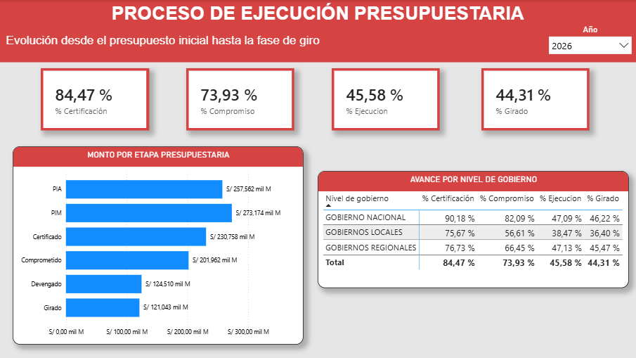
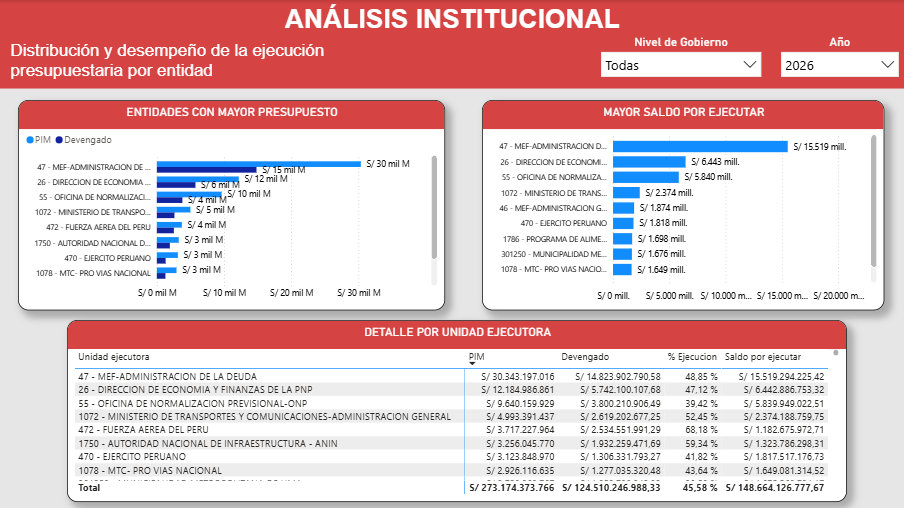
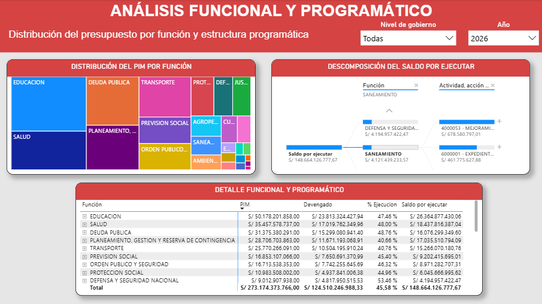
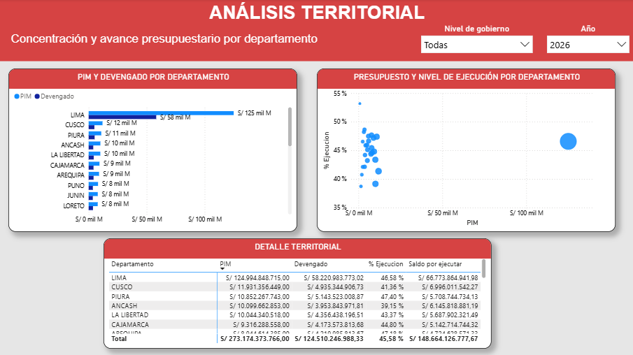
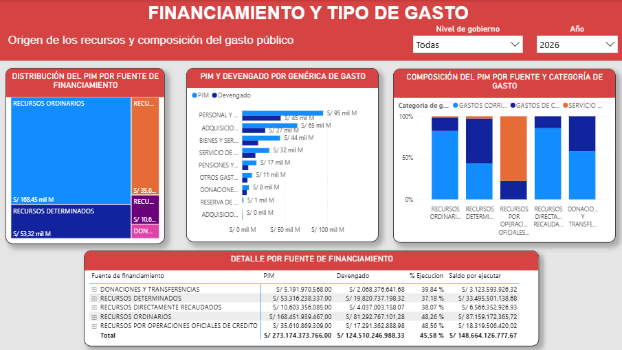
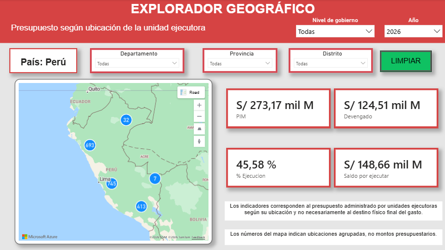

# Dashboard de ejecución presupuestaria en Power BI

## Objetivo

El dashboard presenta una visión analítica de la ejecución presupuestaria pública del Perú para los años 2024, 2025 y 2026, utilizando datos oficiales del Ministerio de Economía y Finanzas (MEF).

Permite analizar:

- presupuesto inicial y presupuesto vigente;
- certificación, compromiso, devengado y girado;
- nivel de ejecución presupuestaria;
- distribución por nivel de gobierno;
- entidades y unidades ejecutoras;
- funciones y estructura programática;
- territorio;
- fuentes de financiamiento y tipo de gasto;
- ubicación geográfica de las unidades ejecutoras.

El año 2026 corresponde a un año en curso. El archivo de 2026 utilizado por el proyecto fue descargado y verificado el 18/07/2026, hora de Perú.

---

## Modelo analítico

Power BI consume el esquema dimensional `analytics` de PostgreSQL y no la tabla de `staging` directamente.

El modelo contiene una tabla de hechos y ocho dimensiones:

- `fact_ejecucion_presupuestal`;
- `dim_tiempo`;
- `dim_institucion`;
- `dim_meta_presupuestaria`;
- `dim_funcional`;
- `dim_financiamiento`;
- `dim_clasificador_gasto`;
- `dim_ubicacion_ejecutora`;
- `dim_departamento_meta`.

La tabla de hechos contiene **7,698,240 registros** y **18 medidas monetarias** almacenadas como `NUMERIC(24,2)`.


---

## Indicadores principales

### PIA

Presupuesto Institucional de Apertura. Representa el presupuesto aprobado al inicio del año fiscal.

### PIM

Presupuesto Institucional Modificado. Es el presupuesto vigente después de incorporar modificaciones presupuestarias durante el año.

### Certificado

Monto reservado dentro del presupuesto disponible para respaldar una futura obligación.

### Comprometido

Monto asociado a obligaciones formalmente asumidas por la entidad.

### Devengado

Monto correspondiente a obligaciones reconocidas después de verificar la recepción del bien, servicio u otra condición aplicable.

### Girado

Monto para el cual se ha emitido la orden de pago.

### Porcentaje de ejecución

Se calcula mediante:

```DAX
% Ejecución =
DIVIDE ( [Devengado], [PIM], 0 )
```

Expresa qué proporción del presupuesto vigente ha sido devengada.

### Saldo por ejecutar

Se calcula mediante:

```DAX
Saldo por ejecutar =
[PIM] - [Devengado]
```

Representa el presupuesto vigente que todavía no ha sido devengado.

---

## Páginas del informe

### 1. Resumen ejecutivo

Presenta los indicadores principales y una comparación general de la ejecución presupuestaria.

Incluye:

- PIM;
- Devengado;
- porcentaje de ejecución;
- saldo por ejecutar;
- evolución 2024-2026;
- comparación por nivel de gobierno.


---

### 2. Proceso de ejecución presupuestaria

Muestra la evolución financiera desde el presupuesto inicial hasta la fase de giro.

Incluye:

- porcentaje de certificación;
- porcentaje de compromiso;
- porcentaje de ejecución;
- porcentaje de girado;
- montos por etapa presupuestaria;
- comparación por nivel de gobierno.



---

### 3. Análisis institucional

Permite identificar entidades y unidades ejecutoras con mayor presupuesto o mayor saldo pendiente de ejecución.

Incluye:

- entidades con mayor PIM;
- entidades con mayor saldo por ejecutar;
- detalle por unidad ejecutora;
- filtro por nivel de gobierno.



---

### 4. Análisis funcional y programático

Analiza la distribución presupuestaria según funciones públicas y estructura programática.

Incluye:

- distribución del PIM por función;
- árbol de descomposición del saldo por ejecutar;
- detalle por función y estructura programática.



---

### 5. Análisis territorial

Compara presupuesto y ejecución entre departamentos.

Incluye:

- PIM y Devengado por departamento;
- relación entre tamaño presupuestario y porcentaje de ejecución;
- detalle territorial.



---

### 6. Financiamiento y tipo de gasto

Explica el origen de los recursos y la composición del gasto público.

Incluye:

- distribución del PIM por fuente de financiamiento;
- PIM y Devengado por genérica de gasto;
- composición por fuente y categoría de gasto;
- detalle por fuente de financiamiento.



---

### 7. Explorador geográfico

Permite navegar por la jerarquía territorial:

```text
Perú -> Departamento -> Provincia -> Distrito
```

La página contiene:

- segmentadores territoriales;
- filtro por nivel de gobierno;
- Azure Maps con agrupación de puntos;
- PIM;
- Devengado;
- porcentaje de ejecución;
- saldo por ejecutar;
- botón para limpiar la selección territorial;
- mensaje dinámico cuando una combinación no contiene datos.



#### Consideración territorial

Los indicadores representan presupuesto administrado por unidades ejecutoras según su ubicación geográfica y no necesariamente el destino físico final del gasto.

Los números mostrados en los clústeres del mapa corresponden a ubicaciones agrupadas, no a montos presupuestarios.

---

## Filtros e interacción

El informe utiliza principalmente:

- Año;
- Nivel de gobierno;
- Departamento;
- Provincia;
- Distrito.

El estado inicial de la versión final es:

```text
Año: 2026
Nivel de gobierno: Todas
Departamento: Todas
Provincia: Todas
Distrito: Todas
```

Los gráficos, tarjetas, matrices y el mapa reaccionan al contexto de filtros de cada página.

---

## Actualización de datos

El informe se conecta a PostgreSQL mediante:

```text
Servidor: 127.0.0.1:5432
Base de datos: peru_public_budget
Esquema: analytics
```

Las credenciales no se incluyen en el repositorio.

Para actualizar el informe localmente se requiere:

1. disponer de PostgreSQL;
2. ejecutar la ingesta y transformación;
3. cargar los esquemas `staging` y `analytics`;
4. abrir `peru_public_budget_monitor_desarrollo.pbix`;
5. pulsar **Actualizar** en Power BI Desktop;
6. validar los principales totales antes de generar una nueva versión final.

---

## Distribución del archivo Power BI

Los archivos `.pbix` no se versionan dentro del historial Git debido a su tamaño y naturaleza binaria.

La versión final se distribuirá como archivo adjunto de una GitHub Release:

```text
peru_public_budget_monitor_final.pbix
```

La versión de desarrollo conserva los controles internos y se mantiene localmente:

```text
peru_public_budget_monitor_desarrollo.pbix
```

---

## Alcance temporal actual

Aunque la fuente contiene doce columnas mensuales de Devengado, el modelo dimensional implementado para esta versión tiene un grano analítico anual.

Por tanto, el dashboard actual compara 2024, 2025 y 2026 mediante indicadores anuales acumulados al corte disponible.

---

## Trabajo futuro

Una ampliación prevista consiste en normalizar las doce columnas mensuales de Devengado mediante una tabla de hechos mensual.

Esto permitiría:

- evolución mes a mes;
- ejecución acumulada;
- comparaciones YTD entre periodos equivalentes;
- análisis de estacionalidad;
- detección de concentración del gasto al cierre del año.